<!-- ═══════════════════════════════════════════════════════════════════════ -->
<!--                           R _ V I E R A                              -->
<!--                     github.com/rviers • est. 2026                    -->
<!-- ═══════════════════════════════════════════════════════════════════════ -->

<div align="center">

<!-- ─── ANIMATED HEADER ─── -->


<!-- ─── TAGLINE ─── -->
<br/>

[](https://git.io/typing-svg)

<br/>

<!-- ─── QUICK BADGES ─── -->
<a href="https://github.com/rviers"></a>


</div>

<br/>

<!-- ═══════════════════════════════════════════════════════════════════════ -->
<!--                        AETHER LOG WIDGET                              -->
<!-- ═══════════════════════════════════════════════════════════════════════ -->

<div align="center">
  
</div>

<br/>

<!-- ═══════════════════════════════════════════════════════════════════════ -->
<!--                           ABOUT ME                                    -->
<!-- ═══════════════════════════════════════════════════════════════════════ -->

## `▸ whoami`

```yaml
name: Rafael Viera
alias: R_Viera
location: Jakarta, Indonesia  # UTC+7
focus:
  - AI Agent Architecture & Orchestration
  - Cybersecurity & Threat Intelligence
  - Full-Stack Systems Engineering
  - Cloud Infrastructure & DevSecOps

current_project: "Aether — My personal AI assistant framework"
philosophy: "Automate the boring. Secure the critical. Build what matters."
```

<br/>

<!-- ═══════════════════════════════════════════════════════════════════════ -->
<!--                           TECH STACK                                  -->
<!-- ═══════════════════════════════════════════════════════════════════════ -->

## `▸ tech --stack`

<div align="center">
<table>
<tr>
<td align="center" width="140"><b>Languages</b></td>
<td align="center" width="140"><b>Frontend</b></td>
<td align="center" width="140"><b>Backend</b></td>
<td align="center" width="140"><b>Infrastructure</b></td>
<td align="center" width="140"><b>Security</b></td>
</tr>
<tr>
<td align="center">
  
</td>
<td align="center">
  
</td>
<td align="center">
  
</td>
<td align="center">
  
</td>
<td align="center">
  
</td>
</tr>
</table>
</div>

<br/>

<!-- ═══════════════════════════════════════════════════════════════════════ -->
<!--                        GITHUB ANALYTICS                               -->
<!-- ═══════════════════════════════════════════════════════════════════════ -->

## `▸ git stats`

<div align="center">
  <picture>
    <source media="(prefers-color-scheme: dark)" srcset="https://github-readme-stats.vercel.app/api?username=rviers&show_icons=true&theme=tokyonight&hide_border=true&bg_color=1a1b27&title_color=c0caf5&text_color=a9b1d6&icon_color=bb9af7&ring_color=7aa2f7&border_radius=12&include_all_commits=true&count_private=true"/>
    
  </picture>
  &nbsp;&nbsp;
  <picture>
    <source media="(prefers-color-scheme: dark)" srcset="https://streak-stats.demolab.com?user=rviers&theme=tokyonight&hide_border=true&background=1a1b27&ring=7aa2f7&fire=ff9e64&currStreakLabel=c0caf5&sideLabels=a9b1d6&dates=565f89&border_radius=12"/>
    
  </picture>
</div>

<br/>

<div align="center">
  <picture>
    <source media="(prefers-color-scheme: dark)" srcset="https://github-readme-stats.vercel.app/api/top-langs/?username=rviers&layout=compact&theme=tokyonight&hide_border=true&bg_color=1a1b27&title_color=c0caf5&text_color=a9b1d6&border_radius=12&langs_count=8"/>
    
  </picture>
</div>

<br/>

<!-- ─── TROPHIES ─── -->
<div align="center">
  
</div>

<br/>

<!-- ═══════════════════════════════════════════════════════════════════════ -->
<!--                      CONTRIBUTION SNAKE                               -->
<!-- ═══════════════════════════════════════════════════════════════════════ -->

## `▸ contributions`

<div align="center">
  <picture>
    <source media="(prefers-color-scheme: dark)" srcset="https://raw.githubusercontent.com/rviers/rviers/output/github-snake-dark.svg"/>
    <source media="(prefers-color-scheme: light)" srcset="https://raw.githubusercontent.com/rviers/rviers/output/github-snake.svg"/>
    
  </picture>
</div>

<br/>

<!-- ═══════════════════════════════════════════════════════════════════════ -->
<!--                       ACTIVITY GRAPH                                  -->
<!-- ═══════════════════════════════════════════════════════════════════════ -->

<div align="center">
  
</div>

<br/>

<!-- ═══════════════════════════════════════════════════════════════════════ -->
<!--                           FOOTER                                      -->
<!-- ═══════════════════════════════════════════════════════════════════════ -->

<div align="center">


<br/>

```
"The best systems are the ones you never notice — until they save you."
```

<sub>This profile is autonomously maintained by <b>Aether</b> — my personal AI assistant framework.</sub>

</div>
