<!-- ═══════════════════════════════════════════════════════════════════ -->
<!-- AETHER DESIGN ACADEMY — Auto-generated daily by Aether            -->
<!-- Theme: Solarized Dark | Principle: Complementary — Scientific Precision              -->
<!-- Day 222 of 2026 | Generated: 2026-08-11T15:41:07.520Z -->
<!-- ═══════════════════════════════════════════════════════════════════ -->

<div align="center">

<!-- ─── HEADER ─── -->


<br/>

<!-- ─── TYPING SVG ─── -->
[](https://github.com/rviers)

<br/>

<!-- ─── BADGES ─── -->
<a href="https://github.com/rviers"></a>


</div>

<br/>

<!-- ═══════════════════ AETHER LOG ═══════════════════ -->

<div align="center">
  
</div>

<br/>

<!-- ═══════════════════ ABOUT ═══════════════════ -->

## `▸ whoami`

```yaml
name: Rafael Viera
alias: R_Viera
location: Jakarta, Indonesia  # UTC+7
focus:
  - AI Agent Architecture & Orchestration
  - Cybersecurity & Threat Intelligence
  - Full-Stack Systems Engineering
  - Cloud Infrastructure & DevSecOps

current_project: "Aether — my personal AI assistant framework"
today_learning: "Complementary — Scientific Precision"
```

<br/>

<!-- ═══════════════════ DESIGN LESSON ═══════════════════ -->

<details>
<summary>🎨 <b>Today's Design Lesson: Complementary — Scientific Precision</b></summary>
<br/>

> Ethan Schoonover's masterwork uses precise L*a*b* values to ensure every color pair passes accessibility. Teal (175°) and warm yellow (45°) are classic complements. The lesson: a truly professional palette is mathematically derived, not eyeballed. Every value has a reason — this is color engineering, not color decoration.

**Theme:** `Solarized Dark` — Palette: `#002b36` `#073642` `#586e75` `#268bd2` `#2aa198`

*This profile rotates through 30 design themes, each teaching a different color theory principle. Powered by [Aether](https://github.com/rviers/rviers).*

</details>

<br/>

<!-- ═══════════════════ TECH STACK ═══════════════════ -->

## `▸ tech --stack`

<div align="center">
<table>
<tr>
<td align="center" width="140"><b>Languages</b></td>
<td align="center" width="140"><b>Frontend</b></td>
<td align="center" width="140"><b>Backend</b></td>
<td align="center" width="140"><b>Infrastructure</b></td>
<td align="center" width="140"><b>Security</b></td>
</tr>
<tr>
<td align="center">
  
</td>
<td align="center">
  
</td>
<td align="center">
  
</td>
<td align="center">
  
</td>
<td align="center">
  
</td>
</tr>
</table>
</div>

<br/>

<!-- ═══════════════════ GITHUB STATS ═══════════════════ -->

## `▸ git stats`

<div align="center">
  
  &nbsp;&nbsp;
  
</div>

<br/>

<div align="center">
  
</div>

<br/>

<!-- ─── TROPHIES ─── -->
<div align="center">
  
</div>

<br/>

<!-- ═══════════════════ CONTRIBUTION SNAKE ═══════════════════ -->

## `▸ contributions`

<div align="center">
  <picture>
    <source media="(prefers-color-scheme: dark)" srcset="https://raw.githubusercontent.com/rviers/rviers/output/github-snake-dark.svg"/>
    <source media="(prefers-color-scheme: light)" srcset="https://raw.githubusercontent.com/rviers/rviers/output/github-snake.svg"/>
    
  </picture>
</div>

<br/>

<!-- ═══════════════════ ACTIVITY GRAPH ═══════════════════ -->

<div align="center">
  
</div>

<br/>

<!-- ═══════════════════ FOOTER ═══════════════════ -->

<div align="center">


<br/>

```
"Good design is not opinion — it's measurement."
```

<sub>🎨 Today's theme: <b>Solarized Dark</b> — Complementary — Scientific Precision · Autonomously maintained by <b>Aether</b></sub>

</div>
