<!-- ═══════════════════════════════════════════════════════════════════ -->
<!-- AETHER DESIGN ACADEMY — Auto-generated daily by Aether            -->
<!-- Theme: Vesper | Principle: Warm Monochromatic — Luxury Gold              -->
<!-- Day 222 of 2026 | Generated: 2026-08-11T15:44:50.607Z -->
<!-- ═══════════════════════════════════════════════════════════════════ -->

<div align="center">

<!-- ─── HEADER ─── -->


<br/>

<!-- ─── TYPING SVG ─── -->
[](https://github.com/rviers)

<br/>

<!-- ─── BADGES ─── -->
<a href="https://github.com/rviers"></a>


</div>

<br/>

<!-- ═══════════════════ AETHER LOG ═══════════════════ -->

<div align="center">
  
</div>

<br/>

<!-- ═══════════════════ ABOUT ═══════════════════ -->

## `▸ whoami`

```json
{
  "name": "Rafael Viera",
  "alias": "R_Viera",
  "location": "Jakarta, Indonesia",
  "focus": [
    "AI Agent Architecture & Orchestration",
    "Cybersecurity & Threat Intelligence",
    "Full-Stack Systems Engineering",
    "Cloud Infrastructure & DevSecOps"
  ],
  "current_project": "Aether — personal AI assistant framework",
  "today_learning": "Warm Monochromatic — Luxury Gold"
}
```

<br/>

<!-- ═══════════════════ DESIGN LESSON ═══════════════════ -->

<details>
<summary>🎨 <b>Today's Design Lesson: Warm Monochromatic — Luxury Gold</b></summary>
<br/>

> Amber/gold (40°-50°) on a warm dark base creates an evening atmosphere. The lesson: warm monochromatic schemes feel exclusive because they're rare in tech. Most tech palettes default to cool blues. By going warm, you immediately differentiate. The gold accent triggers associations with premium and craftsmanship.

**Theme:** `Vesper` — Palette: `#101010` `#1c1c1c` `#333333` `#ffc799` `#d19a66`

*This profile rotates through 30 design themes, each teaching a different color theory principle. Powered by [Aether](https://github.com/rviers/rviers).*

</details>

<br/>

<!-- ═══════════════════ TECH STACK ═══════════════════ -->

## `▸ tech --stack`

<div align="center">
<table>
<tr>
<td align="center" width="140"><b>Languages</b></td>
<td align="center" width="140"><b>Frontend</b></td>
<td align="center" width="140"><b>Backend</b></td>
<td align="center" width="140"><b>Infrastructure</b></td>
<td align="center" width="140"><b>Security</b></td>
</tr>
<tr>
<td align="center">
  
</td>
<td align="center">
  
</td>
<td align="center">
  
</td>
<td align="center">
  
</td>
<td align="center">
  
</td>
</tr>
</table>
</div>

<br/>

<!-- ═══════════════════ GITHUB STATS ═══════════════════ -->

## `▸ git stats`

<div align="center">
  
  &nbsp;&nbsp;
  
</div>

<br/>

<div align="center">
  
</div>

<br/>

<!-- ─── TROPHIES ─── -->
<div align="center">
  
</div>

<br/>

<!-- ═══════════════════ CONTRIBUTION SNAKE ═══════════════════ -->

## `▸ contributions`

<div align="center">
  <picture>
    <source media="(prefers-color-scheme: dark)" srcset="https://raw.githubusercontent.com/rviers/rviers/output/github-snake-dark.svg"/>
    <source media="(prefers-color-scheme: light)" srcset="https://raw.githubusercontent.com/rviers/rviers/output/github-snake.svg"/>
    
  </picture>
</div>

<br/>

<!-- ═══════════════════ ACTIVITY GRAPH ═══════════════════ -->

<div align="center">
  
</div>

<br/>

<!-- ═══════════════════ FOOTER ═══════════════════ -->

<div align="center">


<br/>

```
"Excellence is not a skill — it's an attitude applied to every line."
```

<sub>🎨 Today's theme: <b>Vesper</b> — Warm Monochromatic — Luxury Gold · Autonomously maintained by <b>Aether</b></sub>

</div>
