<!-- ═══════════════════════════════════════════════════════════════════ -->
<!-- AETHER DESIGN ACADEMY — Auto-generated daily by Aether            -->
<!-- Theme: Everforest | Principle: Biophilic Design — Nature Palette              -->
<!-- Day 223 of 2026 | Generated: 2026-08-12T13:27:38.474Z -->
<!-- ═══════════════════════════════════════════════════════════════════ -->

<div align="center">

<!-- ─── HEADER ─── -->


<br/>

<!-- ─── TYPING SVG ─── -->
[](https://github.com/rviers)

<br/>

<!-- ─── BADGES ─── -->
<a href="https://github.com/rviers"></a>


</div>

<br/>

<!-- ═══════════════════ AETHER LOG ═══════════════════ -->

<div align="center">
  
</div>

<br/>

<!-- ═══════════════════ ABOUT ═══════════════════ -->

## `▸ whoami`

```yaml
name: Rafael Viera
alias: R_Viera
location: Jakarta, Indonesia  # UTC+7
focus:
  - AI Agent Architecture & Orchestration
  - Cybersecurity & Threat Intelligence
  - Full-Stack Systems Engineering
  - Cloud Infrastructure & DevSecOps

current_project: "Aether — my personal AI assistant framework"
today_learning: "Biophilic Design — Nature Palette"
```

<br/>

<!-- ═══════════════════ DESIGN LESSON ═══════════════════ -->

<details>
<summary>🎨 <b>Today's Design Lesson: Biophilic Design — Nature Palette</b></summary>
<br/>

> Greens (130°-160°) and warm stone (40°) mimic a forest floor at dusk. This triggers biophilia — the human affinity for natural environments. The lesson: nature never uses pure hues. Every color in a forest is muted, warm-shifted, and layered. Digital biophilic design should feel like looking at moss, not at a traffic light.

**Theme:** `Everforest` — Palette: `#2d353b` `#343f44` `#475258` `#a7c080` `#7fbbb3`

*This profile rotates through 30 design themes, each teaching a different color theory principle. Powered by [Aether](https://github.com/rviers/rviers).*

</details>

<br/>

<!-- ═══════════════════ TECH STACK ═══════════════════ -->

## `▸ tech --stack`

<div align="center">
<table>
<tr>
<td align="center" width="140"><b>Languages</b></td>
<td align="center" width="140"><b>Frontend</b></td>
<td align="center" width="140"><b>Backend</b></td>
<td align="center" width="140"><b>Infrastructure</b></td>
<td align="center" width="140"><b>Security</b></td>
</tr>
<tr>
<td align="center">
  
</td>
<td align="center">
  
</td>
<td align="center">
  
</td>
<td align="center">
  
</td>
<td align="center">
  
</td>
</tr>
</table>
</div>

<br/>

<!-- ═══════════════════ GITHUB STATS ═══════════════════ -->

## `▸ git stats`

<div align="center">
  
  &nbsp;&nbsp;
  
</div>

<br/>

<div align="center">
  
</div>

<br/>

<!-- ─── TROPHIES ─── -->
<div align="center">
  
</div>

<br/>

<!-- ═══════════════════ CONTRIBUTION SNAKE ═══════════════════ -->

## `▸ contributions`

<div align="center">
  <picture>
    <source media="(prefers-color-scheme: dark)" srcset="https://raw.githubusercontent.com/rviers/rviers/output/github-snake-dark.svg"/>
    <source media="(prefers-color-scheme: light)" srcset="https://raw.githubusercontent.com/rviers/rviers/output/github-snake.svg"/>
    
  </picture>
</div>

<br/>

<!-- ═══════════════════ ACTIVITY GRAPH ═══════════════════ -->

<div align="center">
  
</div>

<br/>

<!-- ═══════════════════ FOOTER ═══════════════════ -->

<div align="center">


<br/>

```
"A forest doesn't rush, yet everything gets done."
```

<sub>🎨 Today's theme: <b>Everforest</b> — Biophilic Design — Nature Palette · Autonomously maintained by <b>Aether</b></sub>

</div>
