<!-- ═══════════════════════════════════════════════════════════════════ -->
<!-- AETHER DESIGN ACADEMY — Auto-generated daily by Aether            -->
<!-- Theme: Horizon | Principle: Analogous Warm — Sunset Gradient              -->
<!-- Day 223 of 2026 | Generated: 2026-08-12T14:17:39.172Z -->
<!-- ═══════════════════════════════════════════════════════════════════ -->

<div align="center">

<!-- ─── HEADER ─── -->


<br/>

<!-- ─── TYPING SVG ─── -->
[](https://github.com/rviers)

<br/>

<!-- ─── BADGES ─── -->
<a href="https://github.com/rviers"></a>


</div>

<br/>

<!-- ═══════════════════ AETHER LOG ═══════════════════ -->

<div align="center">
  
</div>

<br/>

<!-- ═══════════════════ ABOUT ═══════════════════ -->

## `▸ whoami`

```json
{
  "name": "Rafael Viera",
  "alias": "R_Viera",
  "location": "Jakarta, Indonesia",
  "focus": [
    "AI Agent Architecture & Orchestration",
    "Cybersecurity & Threat Intelligence",
    "Full-Stack Systems Engineering",
    "Cloud Infrastructure & DevSecOps"
  ],
  "current_project": "Aether — personal AI assistant framework",
  "today_learning": "Analogous Warm — Sunset Gradient"
}
```

<br/>

<!-- ═══════════════════ DESIGN LESSON ═══════════════════ -->

<details>
<summary>🎨 <b>Today's Design Lesson: Analogous Warm — Sunset Gradient</b></summary>
<br/>

> Red (0°) through orange (30°) to pink (340°) — a tight analogous range on the warm side. The lesson: sunsets work as palettes because they compress the warm spectrum into a single view. The dark base grounds the warmth and prevents it from feeling overwhelming. Time-of-day palettes tap into deep emotional memory.

**Theme:** `Horizon` — Palette: `#1c1e26` `#232530` `#2e303e` `#e95678` `#fab795`

*This profile rotates through 30 design themes, each teaching a different color theory principle. Powered by [Aether](https://github.com/rviers/rviers).*

</details>

<br/>

<!-- ═══════════════════ TECH STACK ═══════════════════ -->

## `▸ tech --stack`

<div align="center">
<table>
<tr>
<td align="center" width="140"><b>Languages</b></td>
<td align="center" width="140"><b>Frontend</b></td>
<td align="center" width="140"><b>Backend</b></td>
<td align="center" width="140"><b>Infrastructure</b></td>
<td align="center" width="140"><b>Security</b></td>
</tr>
<tr>
<td align="center">
  
</td>
<td align="center">
  
</td>
<td align="center">
  
</td>
<td align="center">
  
</td>
<td align="center">
  
</td>
</tr>
</table>
</div>

<br/>

<!-- ═══════════════════ GITHUB STATS ═══════════════════ -->

## `▸ git stats`

<div align="center">
  
  &nbsp;&nbsp;
  
</div>

<br/>

<div align="center">
  
</div>

<br/>

<!-- ─── TROPHIES ─── -->
<div align="center">
  
</div>

<br/>

<!-- ═══════════════════ CONTRIBUTION SNAKE ═══════════════════ -->

## `▸ contributions`

<div align="center">
  <picture>
    <source media="(prefers-color-scheme: dark)" srcset="https://raw.githubusercontent.com/rviers/rviers/output/github-snake-dark.svg"/>
    <source media="(prefers-color-scheme: light)" srcset="https://raw.githubusercontent.com/rviers/rviers/output/github-snake.svg"/>
    
  </picture>
</div>

<br/>

<!-- ═══════════════════ ACTIVITY GRAPH ═══════════════════ -->

<div align="center">
  
</div>

<br/>

<!-- ═══════════════════ FOOTER ═══════════════════ -->

<div align="center">


<br/>

```
"The best interfaces feel like golden hour — warm, clear, and transient."
```

<sub>🎨 Today's theme: <b>Horizon</b> — Analogous Warm — Sunset Gradient · Autonomously maintained by <b>Aether</b></sub>

</div>
